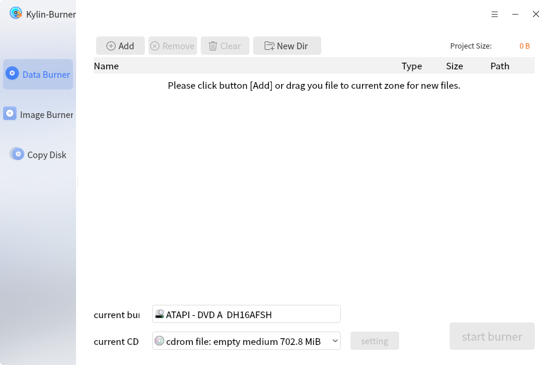
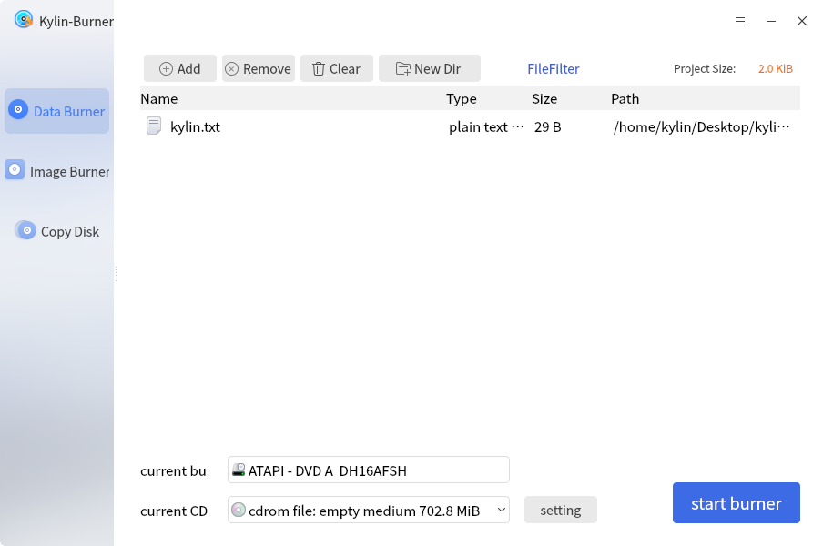
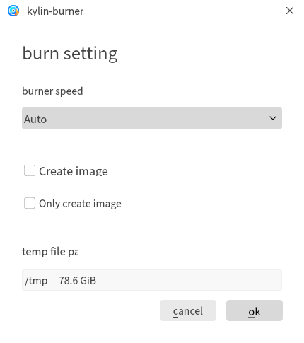
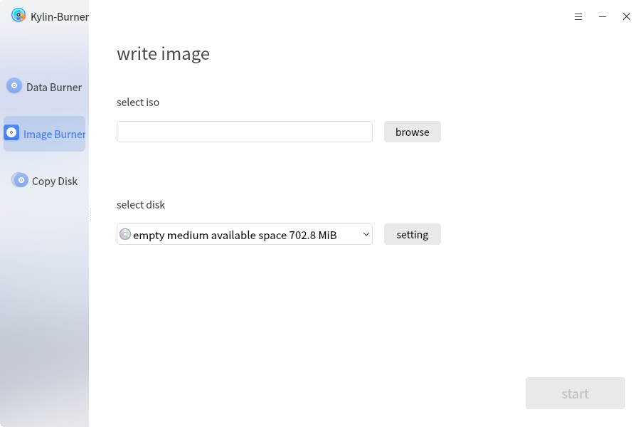
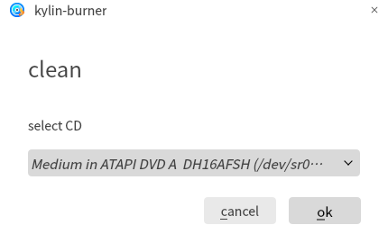
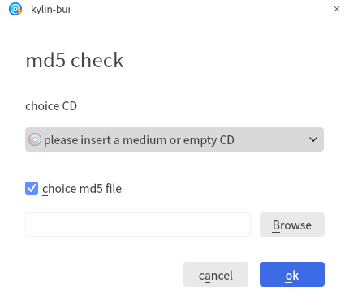

# Kylin Burner
## Overview
Kylin Burner is a tool for burning discs, including data burner, image burner and copy disk.

 

## Basic Function
### Data Burner
The Data Burner interface provides four buttons: Add, Remove, Clear and New Dir.

It will show the files name, type, size and path. 

Data burning window as shown in Fig 2:

1) Add

Click "Add" to open select files window, and choose files to burn in the project.

2) Remove

Delete the selected files.

3) Clear

Delete all files in this project.

4) New Dir

Create a new folder in the project.

Click "settings" and the popup as shown in Fig 3.

### Image Burner
Image burning setup as shown in Fig 4:

- 1) Select disc image 

Open the select files interface, and choose the image file.

- 2) Select disc 

When the system recognizes discs, it will be automatically displayed in the selection menu.

- 3) Burn

Click "start" to start burning process.

 

## Advanced Function
Click  to do other operations.

### Clean
Only readable and writable discs can be erased.

### MD5 Check
As shown in Fig 6.

 

## Using Tips
1) When using burn image, only the file with the suffix of .iso can be selected.

2) Read-only disc can not be erased.

 

## Appendix
### Shortcut Key

| Shortcut | Function |
| :------------ | :------------ | 
| Ctrl + O| Open |
| Ctrl + S| Save |
| Ctrl + Q| Quit |

