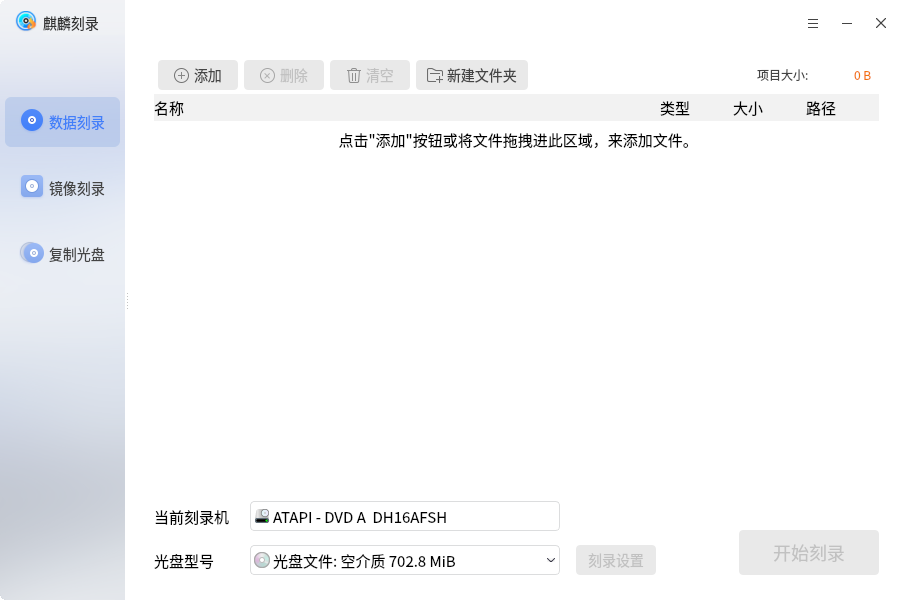
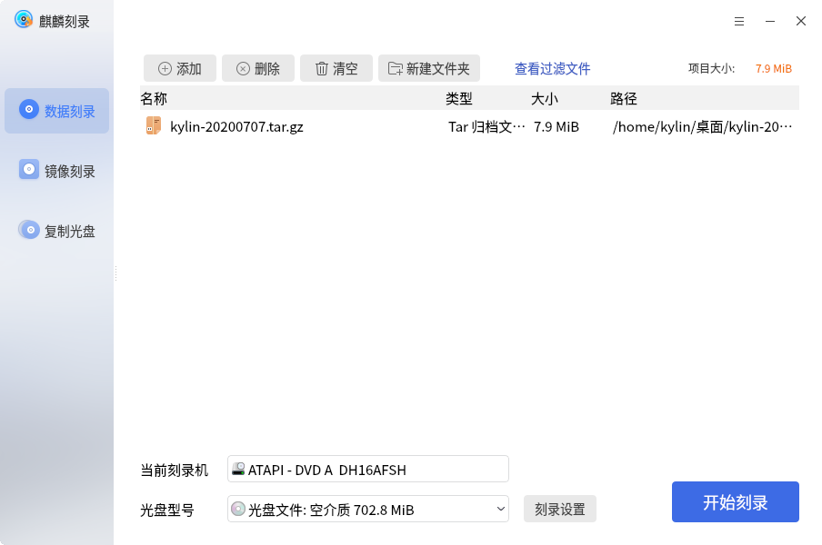
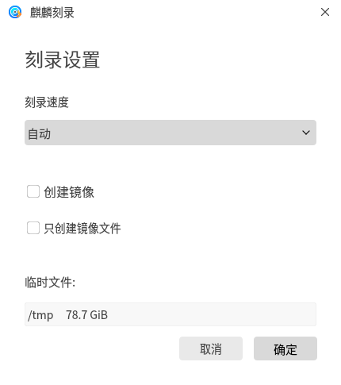
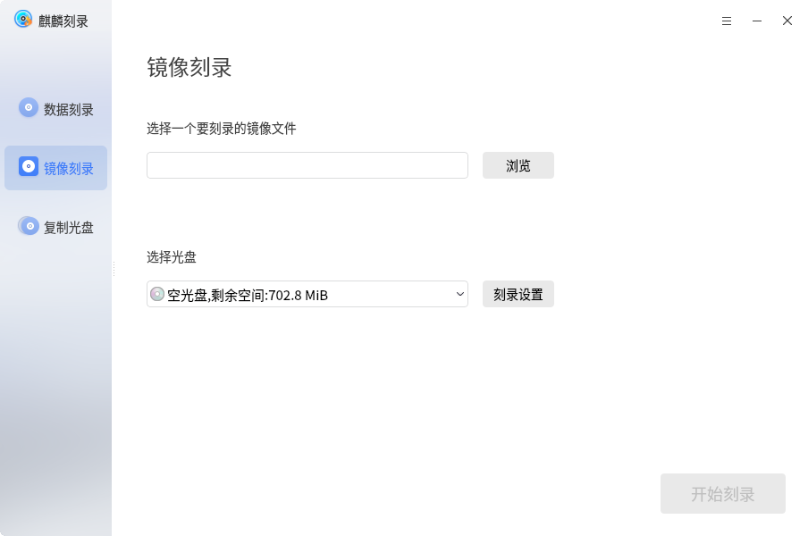
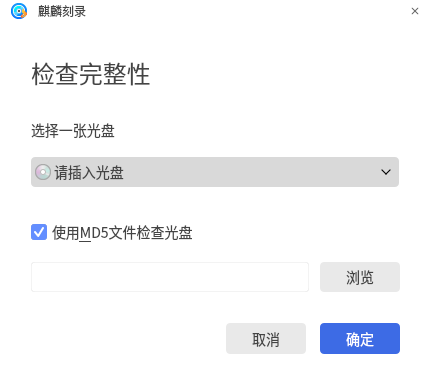

# 麒麟刻录
## 概 述
麒麟刻录是一款用于刻录光盘的工具，包括数据刻录，镜像刻录和复制光盘。主界面如图1所示。

 

## 基本功能
### 数据刻录
数据刻录界面提供四个按钮：添加，删除，清空项目，新建文件夹。

界面中会显示添加的文件名称、类型、大小和路径；下方会显示当前刻录机、光盘型号（如果生成镜像文件，则显示“镜像文件”）。

如图2所示。

点击“刻录设置”，可选择刻录速度等，如图3所示。

### 镜像刻录
镜像刻录界面如图4所示。

1）选择镜像文件：进入文件选择界面，选择要刻录的镜像文件。

2）选择光盘：系统识别到了盘片后，会自动显示在选择列表中。

3）点击“开始刻录”，开始刻录镜像。

 

## 高级功能
点击右上角的“”图标，可进行其他操作。

###  清 除
如图5所示，只有可读可写的光盘可以进行此操作。

### 检查完整性
如图6所示，可勾选使用MD5文件检查光盘。

### 文件过滤设置
如图7所示，可设置在进行数据刻录时，要过滤的文件类型。

 

## 附 录
### 注意事项
1）镜像刻录只能刻录.iso后缀的文件。

2）清除功能只可以用于可读可写的光盘，只读光盘不能进行擦除操作。

### 快捷键

| 快捷键 | 功能 |
| :------------ | :------------ | 
| Ctrl + O | 打开 |
| Ctrl + S | 保存 |	
| Ctrl + Q | 退出 |

